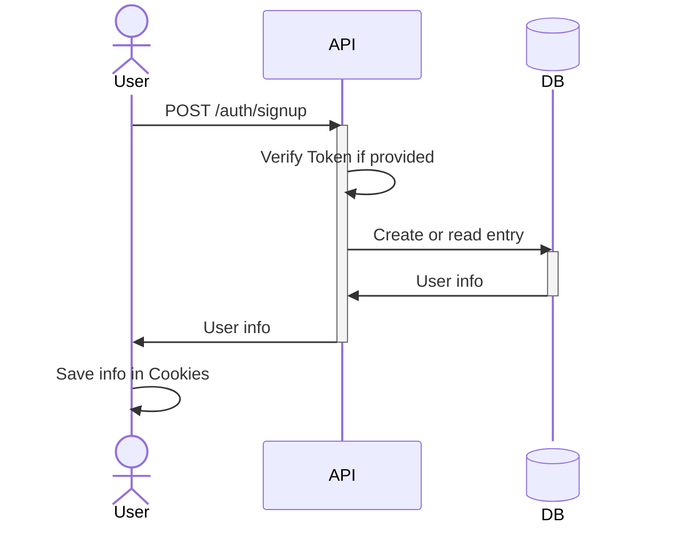
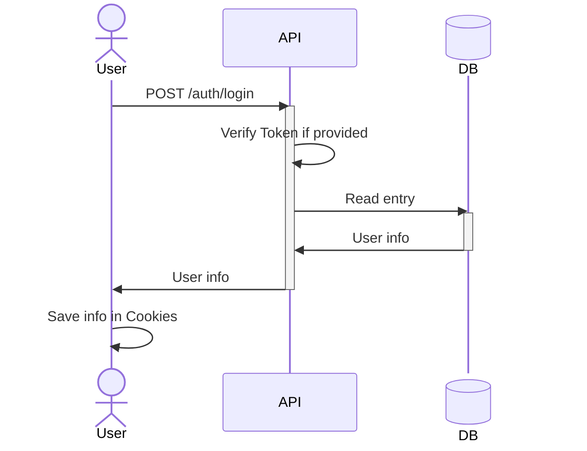
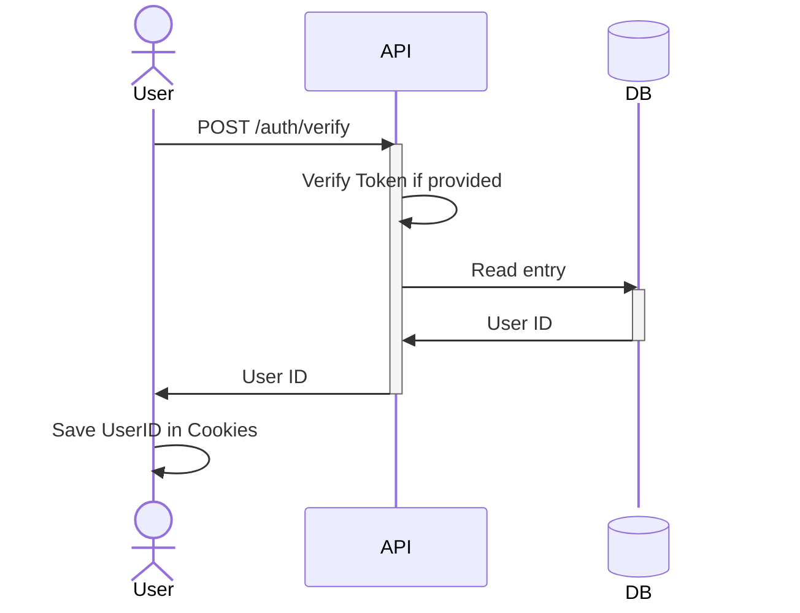
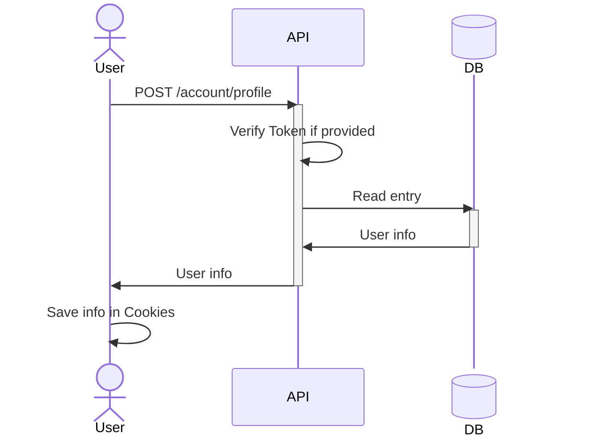
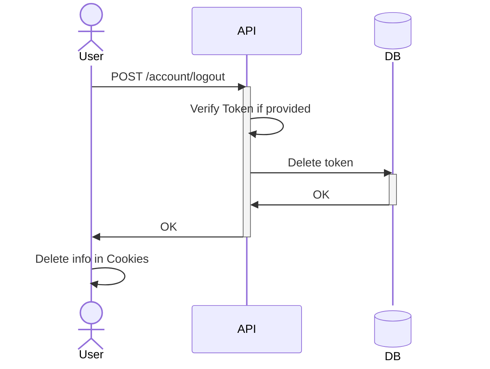

# Flow

User Info example :

```json
{
  "data": {
    "id": "1[...]2-3000-4000-5000-6[...]7",
    "fullName": "John Doe",
    "email": "test@test.test",
    "createdAt": "2026-06-30T08:26:43.659+00:00",
    "updatedAt": "2026-06-30T08:26:43.659+00:00",
    "initials": "JD"
  }
}
```

- `Login` route : should try to use the token in header before creating a new one.
- `Profile` route : returns the same info of login but don't try to create a new access token. It justs uses the current one.
- `Logout` route : takes a token and deletes it from DB.

## Signup



## Login



## Verify



## Profile



## Logout


