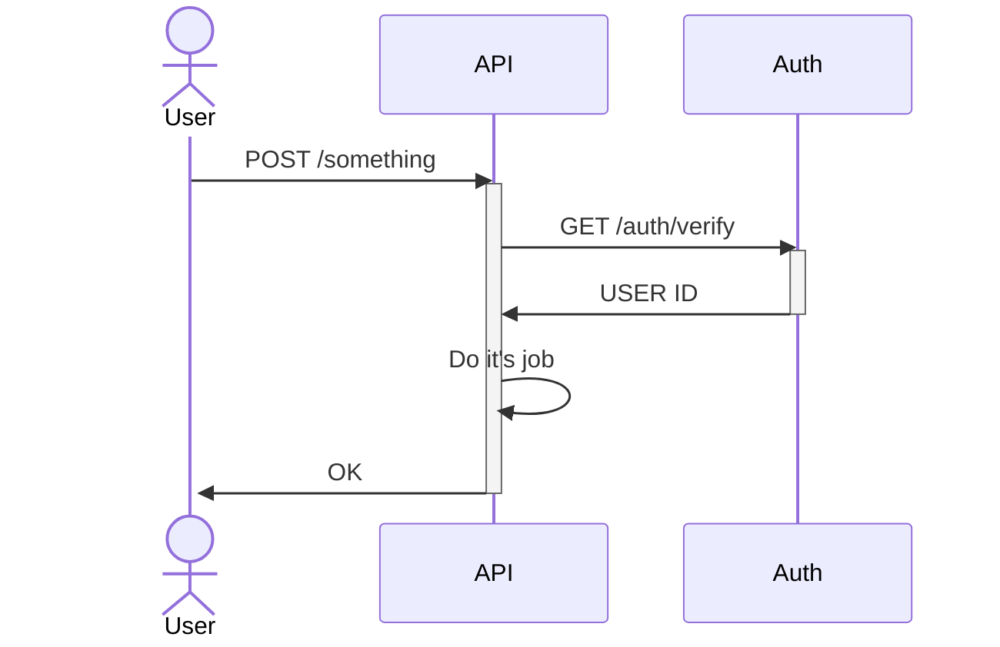

# How to use

## Use Auth from another service

The User needs to be authentificated and provides a token in all the requests.

```mermaid
sequenceDiagram
    actor User
    participant API_example as API
    participant API_auth as Auth

    User->>API_example: POST /something
    activate User
    activate API_example
    API_example->>API_auth: GET /auth/verify
    activate API_auth
    API_auth->>API_example: USER ID
    deactivate API_auth
    API_example->>API_example: Do it's job
    API_example->>User: OK
    deactivate API_example
```
